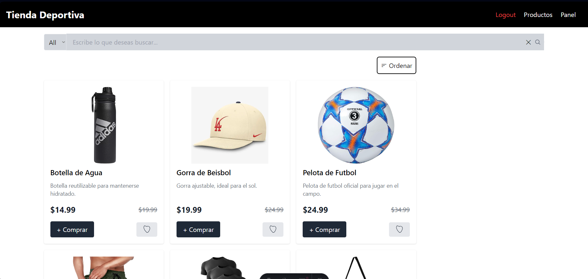
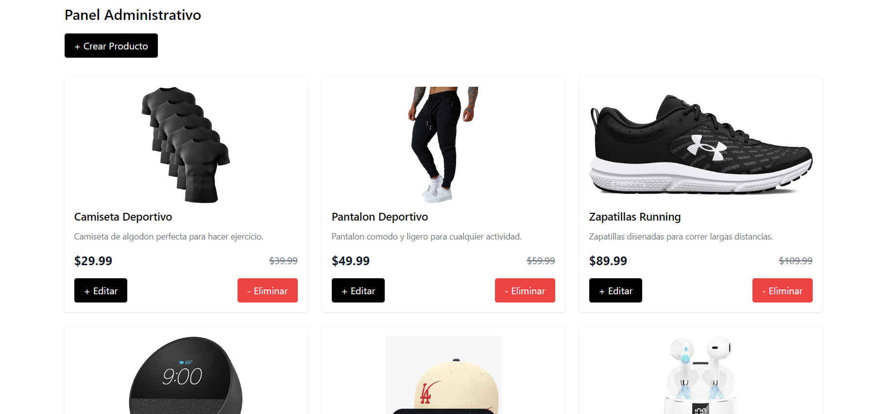
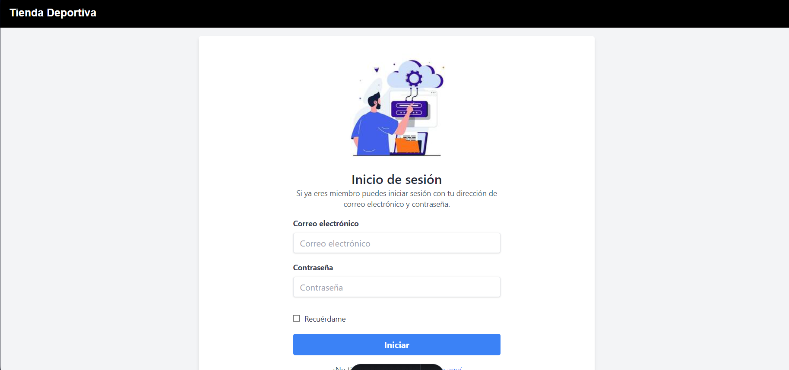
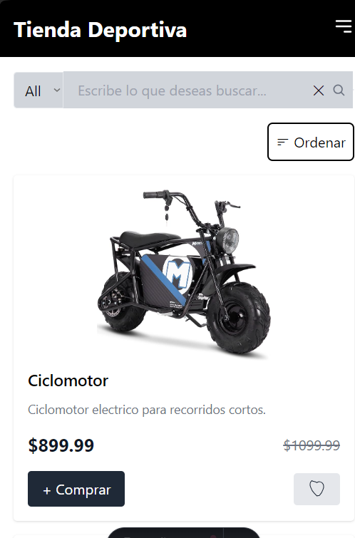
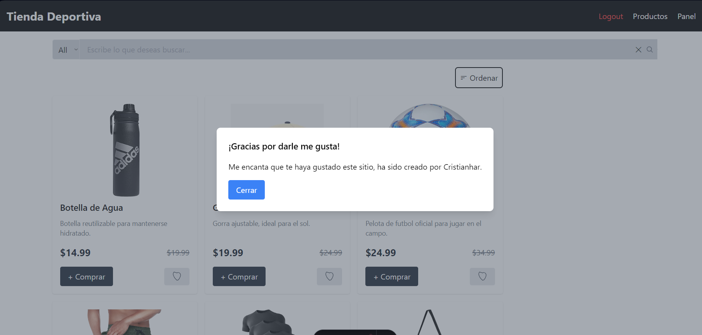

# Tienda Deportiva

¡Bienvenido al proyecto Tienda Deportiva! Este es un sitio web de comercio electrónico desarrollado utilizando **Tailwind**, **Astro**, **MySQL**, **JavaScript**, **Node.js**,**Cloudinary**,**Express** y **TypeScript**.

## Previews


---



---



---


---



---




## Requisitos

- **Docker**: Asegúrate de tener Docker instalado en tu máquina. [Instrucciones de instalación](https://docs.docker.com/get-docker/).

## Instrucciones para Ejecutar el Proyecto

1. **Clonar el Repositorio**:

   ```bash
   git clone https://github.com/cristianhar/Tienda-Deportiva.git

2.  **Ejecutar en consola**:
    ```bash
      cd Tienda-Deportiva
      docker-compose up --build
# El backend se abrirá en localhost:3000
# El frontend se abrirá en localhost:4321
        
3. **Ejecución Individual del Backend**:
   Si deseas ejecutar el backend individualmente, navega a la carpeta correspondiente y ejecuta:

    ```bash
    cd tienda-backend
    docker-compose up --build

4. **Ejecución Individual del Frontend**:
Si deseas ejecutar el frontend individualmente, navega a la carpeta correspondiente y ejecuta:

    ```bash
    cd tienda-frontend
    npm run dev


